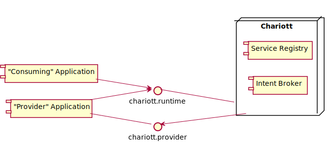

# Design Specification for Project Eclipse Chariott

- [Introduction](#introduction)
- [Architecture](#architecture)
- [Chariott Sequence Diagram](#chariott-sequence-diagram)

## <a name="introduction">Introduction</a>

Project Eclipse Chariott delivers a metadata-driven application programming model. Today, Chariott serves two main purposes. First, it offers service discovery of "provider" applications advertising their functionality. These providers register their capabilities with Chariott. Second, Chariott provides the brokering of intent requests from any application towards the offering providers. Chariott was founded on [Capability Oriented Architecture](https://www.linkedin.com/pulse/brief-introduction-capability-oriented-architecture-coa-haishi-bai/) (COA). Since Chariott provides a common [gRPC](https://grpc.io/) interface for interacting with applications, it can be used with any language supporting gRPC. For more details on the gRPC interfaces, please see the [proto folder](../../proto/chariott/).

## <a name="architecture">Architecture</a>

Chariott itself has two main architectural components.

- Service Registry
- Intent Broker

The service registry is used for service discovChariott Sequence Diagramery. It maintains a mapping of namespace to a list of services that are currently registered with that namespace and the metadata needed to communicate with that service.

The Intent Broker maintains a mapping of namespace and intent with the connection for the provider that can fulfill that intent request. It is used for brokering through Chariott.

Applications which interact with Chariott represent two additional architectural concepts.

- Applications -- represent any software component
- Providers -- represent a software component which registers itself and its capabilities with Chariott

The phrase "consuming application" can be used to describe an application which uses Chariott to interact with another application, either through service discovery or intent brokering. It is important to note that any software component can use Chariott's service registry or intent broker to interact with another software component, including providers. In other words, an application can be both a provider and a "consuming application".

Below is the component diagram for Chariott.

## <a name="sequence">Chariott Sequence Diagram</a>

**Note:** Communication into and out of Chariott goes through the Chariott Server, a gRPC interface. Here, that is represented by the grey box.

1. Consuming application sends a Fulfill request to Discover the ‘sdv.sample.namespace’
1. No provider has been registered for ‘sdv.sample.namepsace’ so Chariott returns an Error saying no provider found.
1. The AnnounceRequest is sent to Chariott. This step is optional, but it will tell the provider if they have already been registered.
1. A result of “ANNOUNCED” means that a provider with this namespace is not currently in the registry.
1. A RegisterRequest adds the provider to the Chariott registry. It sends its service information and the intents it can fulfill.
1. When this change is triggered, on_change will get called to add the intent bindings for this provider to the intent broker.
1. A RegisterResponse is sent back to the provider
1. Provider starts a loop of AnnounceRequests so it does not get pruned
1. As long as the AnnounceResponse is NOT_CHANGED, the provider is still present in the registry. If at any point it receives an “ANNOUNCED” response, it should re-register itself with Chariott.
1. Consuming application sends a Fulfill request to Discover the ‘sdv.sample.namespace’
1. Intent Broker sends a Fulfill request to its intent binding for ‘sdv.sample.namespace’ Discover
1. Consuming application returns a fulfillment response with a list of services for that namespace including the url, protocol, and schemaReference file (i.e. proto file name) for how to directly communicate with the provider
1. The intent broker returns this fulfillment response to the consuming application
1. Consuming application directly calls API_A on the provider (which it found in the schema file). This is an example of direct application communication after using Chariott for Service Discovery.
1. Provider sends its response to the consuming application directly for API_A
1. Consuming application sends a Fulfill request to Inspect information about ‘sdv.sample.namespace’
1. Intent Broker sends a Fulfill request to its intent binding for ‘sdv.sample.namespace’ Inspect
1. Provider sends a FulfillResponse with the properties of the provider.
1. The intent broker returns this fulfillment response to the consuming application
1. Consuming application sends a Fulfill Request to Invoke command1 on the ‘sdv.sample.namespace’
1. Intent Broker sends a Fulfill request to its intent binding for ‘sdv.sample.namespace’
1. Provider sends a FulfillResponse
1. The intent broker returns this fulfillment response to the consuming application
1. At this point, the provider exits. When this happens, it will no longer be pushing its continuous announce heartbeat to Chariott. After a configured amount of time, Chariott will prune this service from the registry and on_change will get called to remove the intent bindings for this provider to the intent broker.
1. Consuming application sends a Fulfill request to Discover the ‘sdv.sample.namespace’
1. Since the provider has been removed from the registry, it will return an Error saying no provider found.
